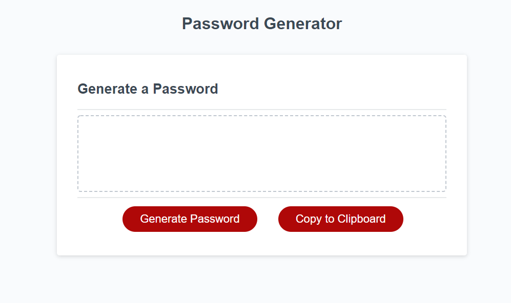

# pwgen
Basic Password Generator. This will hopefully be interchangeable and show different logics to process the code. If the script in index.html is selected as "script.js" it will show a basic working function that essentially consist of each available solution and then processes the math loop. In the coming days I will try and work on another method in "script2.js"

https://aabazary.github.io/pwgen/

